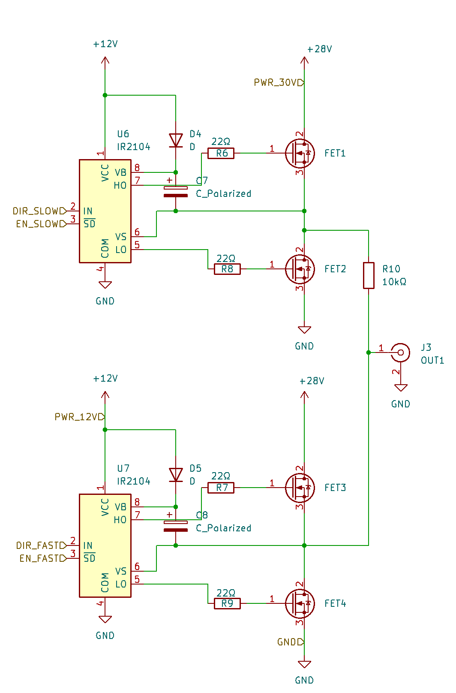

# A Simplistic Driver for Slip-Stick Piezo Positioners

This project presents a minimalistic, low-cost driver for slip-stick piezo positioners.

Conventional slip-stick piezo drivers typically rely on operational amplifiers to generate sawtooth waveforms. While this approach gives the most control over the stage, driving highly capacitive piezo loads with op-amps requires careful compensation and layout to avoid instability and self-oscillations.

In contrast, this driver avoids operational amplifiers altogether. Instead, the piezo load is driven directly using simple MOSFET stages. This significantly simplifies the circuit and improves robustness when dealing with capacitive loads, making the design well suited for ad-hoc, experimental, or budget-constrained setups.

The goal of this project is not ultimate performance, but practicality: providing a straightforward and reliable way to generate slip-stick drive signals with minimal component count and design overhead.

## Usage

The driver is straightforward - just connect your slip-stick piezo stage and use 3-way lever-switch to jog the stage. The step amplitude is fixed at 28 V and the step frequency is fixed (in the firmware) at 300 Hz. This values are suitable, e.g. for Attocube ANP series.

The circuit contains a PPTC resettable fuse which trips when we try to drive the short-circuit. It automatically resets upon switching the device off. 

## How it works

The driver generates the characteristic slip-stick waveform by charging and discharging the piezo capacitance directly through MOSFET switches, rather than through linear amplifiers. One stage provides a relatively slow voltage ramp (stick phase), while the other rapidly discharges the piezo (slip phase). Rapid charge/discharge is realized by linking the piezo to VCC/GND directly by a MOSFET. Slow ramp is realized by introducing an extra resistor R in series with the MOSFET. The time-constant of the slope is governed by a product of resistance R and the capacitance of the piezo stage.

Each of 3 modules has the same design:

## What to buy (typical components)

Exact values and footprints are given in the schematics/PCB files, but the design generally requires only common parts:

- 12x N-channel MOSFETs, e.g. STP55NF06L
- 6x half-bridge driver, e.g. IR2104STRPBF
- 3x BNC connector, e.g. R-128
- 3x lever switch, e.g. 1-1825139-8
- 1x power switch, e.g. R13-220BA-01-BBG (mind that this is oversized)
- Raspberry Pico
- some capacitors and resistors
- DC supply socket

## License & Disclaimer

This project is released under the MIT License. You are free to use, modify, and distribute it according to the terms of that license.

The design is provided as-is, without any warranties or guarantees of performance, safety, or suitability for any particular purpose. This is a research/DIY project; use it at your own risk.
